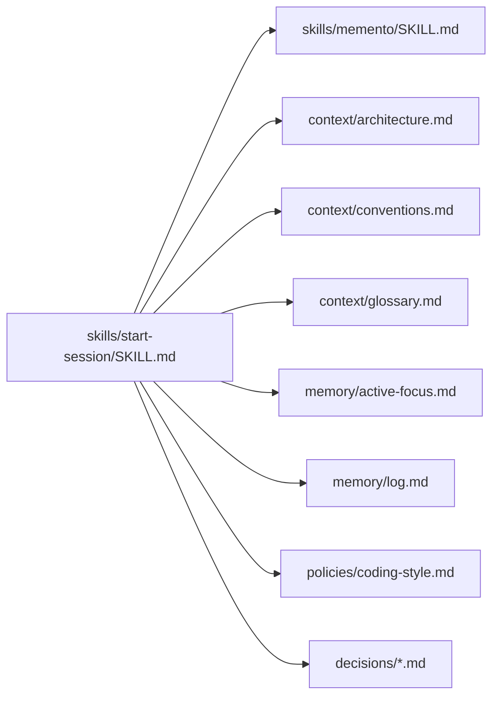
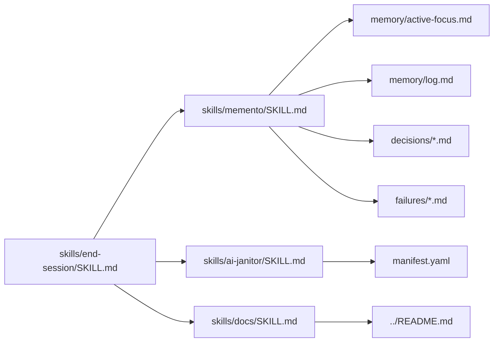

# .agents Workspace Guide

This file documents skills and core artifacts under `.agents` for this bootstrap template.

## Skills

- `skills/start-session/SKILL.md`: session bootstrap skill that loads project context, memory, policy, and related notes.
- `skills/end-session/SKILL.md`: session close-out skill that updates memory artifacts, optional decision/failure notes, and refreshes `manifest.yaml`.
- `skills/memento/SKILL.md`: maintains session-to-session memory continuity.
- `skills/theory-of-mind/SKILL.md`: seeds context and memory from historical threads/logs.
- `skills/ai-janitor/SKILL.md`: keeps `.agents/manifest.yaml` synchronized with `.agents` structure changes.
- `skills/docs/SKILL.md`: updates root `README.md` only when non-`.agents` files changed.

## Core Files

- `manifest.yaml`: canonical index of `.agents` structure and skill metadata.
- `context/architecture.md`: architecture summary, boundaries, and system-level concerns.
- `context/conventions.md`: engineering and collaboration conventions.
- `context/glossary.md`: project terminology and acronyms.
- `memory/active-focus.md`: current objective, in-flight tasks, and immediate next actions.
- `memory/log.md`: long-term chronological memory log; decision/failure links are optional and only added when directly related.
- `decisions/YYYYMMDD-placeholder.md`: starter template for dated ADR-style decisions.
- `failures/YYYYMMDD-placeholder.md`: starter template for dated failure notes.
- `policies/coding-style.md`: coding and documentation policy baseline.

## Dependency Graph

### Start-session flow

### End-session flow

